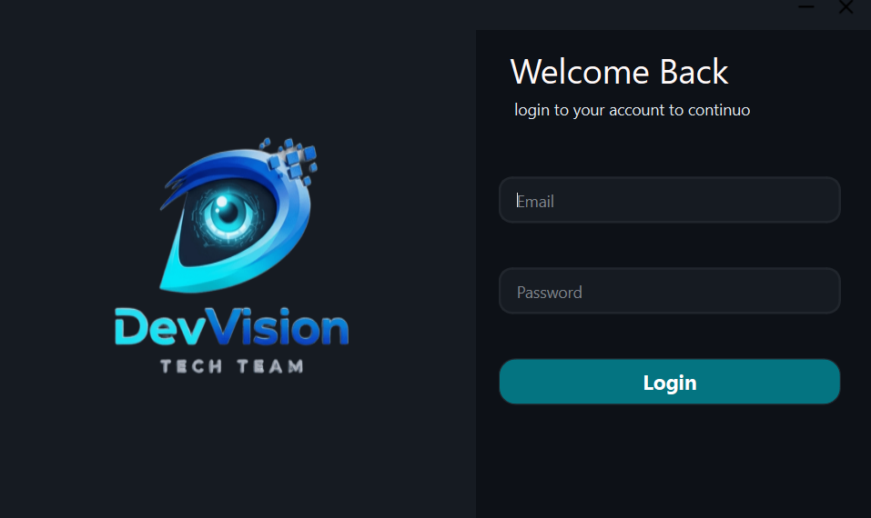
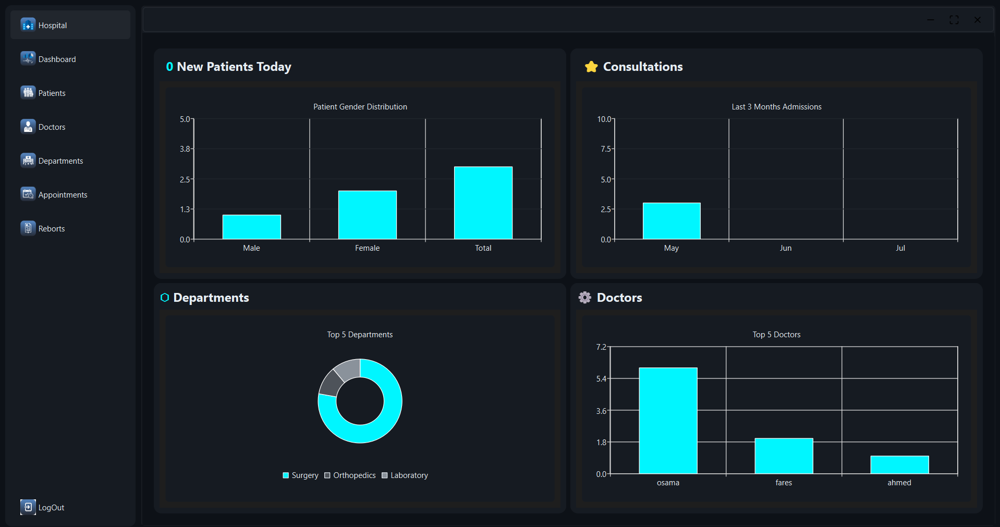
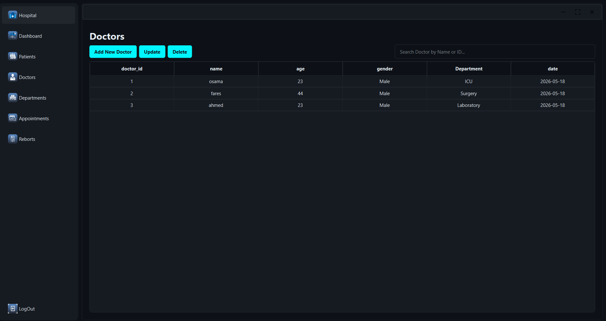
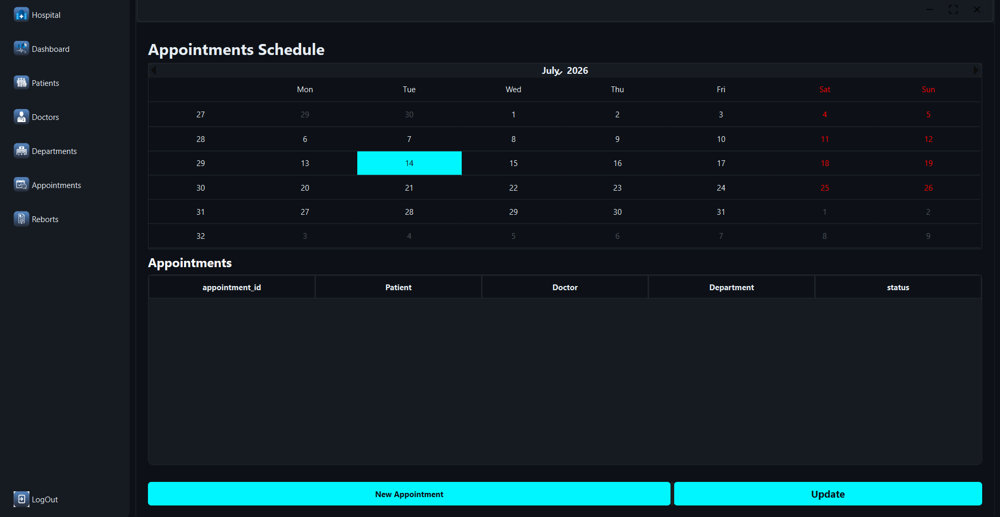
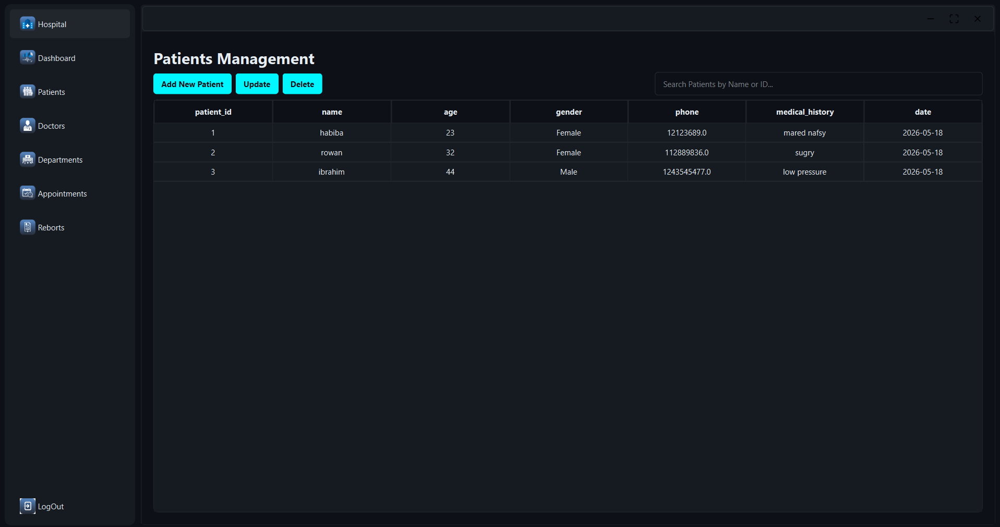
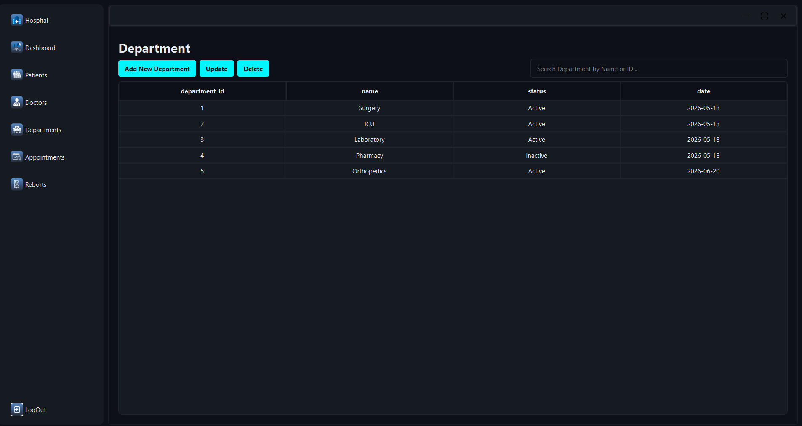
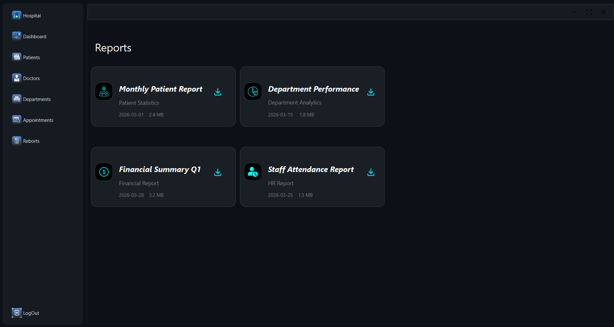

# 🏥 Hospital Management System (Qt GUI)


> A robust, feature-rich Desktop Application designed to streamline medical institution workflows, monitor department operations, manage staff records, and automate patient scheduling.

---

## ✨ Key Features

- 🔐 **Secure Authentication**: Customized Login framework protecting internal clinical workflows.
- 👨‍⚕️ **Staff Administration**: Create, update, and fetch dynamic details for hospital specialists.
- 📋 **Patient Profiling**: Detailed record-keeping system for medical tracking and clinical status.
- 📅 **Appointment Scheduling**: Dynamic dialog-based booking management matching doctors with slots.
- 🏢 **Departmental Management**: Comprehensive tools to structure internal hospital zones and medical wings.
- 🗄️ **Persistent Data**: Seamless structural DB layer keeping patient/doctor matrices fully synced.

---

## 🛠️ Architecture & Tech Stack

- **Language**: C++ (OOP Principles, Clean Architecture)
- **GUI Framework**: Qt Widgets (`QDialog`, `QMainWindow`, custom `.ui` interfaces)
- **Build System**: QMake (`Hospital.pro`)
- **Environment**: Qt Creator / Windows Environment

---

## 📸 Application Screenshots

### 🖥️ Desktop System Interfaces

| Login & Access                                    | Main Dashboard                                        |
| ------------------------------------------------- | ----------------------------------------------------- |
|  |  |

| Doctor Administration                              | Appointments & Dialogs                                   |
| -------------------------------------------------- | -------------------------------------------------------- |
|  |  |

| Patient Records                                      | Department Controls                                    |
| ---------------------------------------------------- | ------------------------------------------------------ |
|  |  |

|                   System Reports                    |
| :-------------------------------------------------: |
|  |

---

## 🚀 Getting Started

### Prerequisites

Make sure you have **Qt Creator** and a suitable **C++ toolchain** (MinGW / MSVC) installed.

### Build and Run

1. **Clone the repository**:
   ```bash
   git clone https://github.com
   ```
2. Open `Hospital.pro` in **Qt Creator**.
3. Select your compiler kit (e.g., Desktop Qt MinGW).
4. Press **Run (Ctrl + R)** to compile and launch.

---

## 📫 Contact Developer

- 🌐 **GitHub**: [://github.com](https://://github.com)
- 💼 **LinkedIn**: [://linkedin.com](https://://linkedin.com)
- 📧 **Email**: esamfares92@gmail.com
